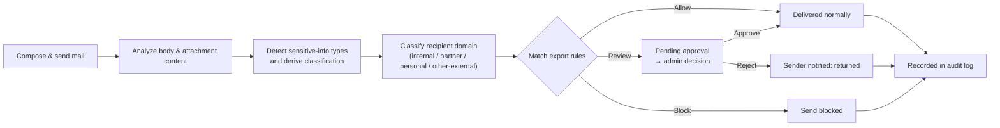
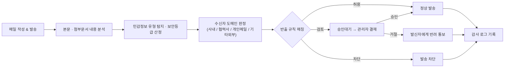

<p align="center">
  
</p>

<h1 align="center">ShhDoc (쉿독)</h1>

<p align="center">
  <b>An AI-powered secure mail platform that grades security by reading <i>content</i>, not filenames.</b><br/>
  Leaks don't happen when the system is breached — they happen the moment someone hits Send.
</p>

<p align="center">
  
  
  
  
  
  
  
</p>

<p align="center">
  <a href="#english">🇺🇸 English</a> ·
  <a href="#한국어">🇰🇷 한국어</a>
</p>

---

# English

## Overview

**ShhDoc** is a content-aware **Data Loss Prevention (DLP) mail platform** built to stop sensitive documents from leaking through everyday company email.

Traditional attachment filters rely on file extensions or filenames, which are trivial to bypass by renaming a file or masking its extension. ShhDoc instead **reads the actual content of the mail body and attached documents**, automatically detecting sensitive-information types and assigning a **security classification** (Public / Internal / Confidential / Secret). It then checks that classification against **admin-defined export rules** and the **recipient category** (internal staff / partner company / personal email / other external), and **blocks or routes to manager approval** any outgoing mail that violates policy — before it ever leaves the building.

In short: the goal of this project is to stop "one email sent by mistake" from becoming a data breach.

## Key Features

### 🛡️ Document Policy Management
Each company defines its own leak-prevention criteria:
- **Sensitive-information types** — register company-specific sensitive categories (contracts, personal data, payroll, etc.) along with AI detection hints
- **Document categories / types** — classify documents by business purpose
- **Recipient domains** — register partner-company and personal-email (Gmail, etc.) domains to sharpen recipient classification; internal and other-external domains are inferred automatically
- **Export rule engine** — combine `direction (all / internal / outbound) × category × document type × sensitive type × classification × recipient scope` to automatically resolve to **Allow / Review / Block**. All filled conditions are ANDed together; an empty condition means "don't care"

### 📧 Secure Mailbox
- Inbox, Sent, Drafts, **Pending Approval**, All Mail, and Trash folders
- Rich-text composition powered by Tiptap (formatting, links, S3-backed attachment uploads)
- Mail body HTML is sanitized through `DOMPurify` with an explicit allow-list for tags, attributes, and inline styles to prevent XSS and clickjacking

### ✅ Approval Workflow
- Mail flagged `REVIEW` by the rule engine does not go out immediately — it moves to **pending admin approval**
- Admins review the full content in the pending queue and either **approve (send)** or **reject (with a reason)**
- The same status is labeled contextually — "returned" to the sender, "send rejected" on the admin screen

### 📊 Audit Log
- Every send is recorded with its **document grade** (external-safe / internal-only) and **delivery result** (delivered / delivery failed / send failed / send blocked)
- Filterable by keyword, grade, result, and date range for incident investigation and compliance reporting

### 🏢 Organization Management
- Member invitations and permissions, department management, role/title management, company profile management
- Company sign-up registers a **fixed corporate email domain**, which becomes the baseline for classifying a send as internal vs. external

### 🔐 Authentication
- Email-based sign-up (creates the company and its admin account together) and login
- JWT auth with a 30-minute access token and a 7-day refresh token; route-level access control via `AuthGuard`, `GuestGuard`, and `AdminGuard`

## How It Works



## Tech Stack

| Layer | Technology |
| --- | --- |
| Framework | [Next.js 16](https://nextjs.org) (App Router), React 19, TypeScript 5 |
| Styling | Tailwind CSS 4, MUI (Material UI) + Emotion |
| State management | Zustand (persist middleware, sessionStorage) |
| Form validation | Zod |
| Rich text editor | Tiptap (StarterKit, TextAlign, TextStyle) |
| HTML sanitization | DOMPurify |
| HTTP client | Axios (interceptor-based shared error/token handling) |
| Font | Pretendard Variable |

> This repository is the **frontend (Next.js) application**. The backend/AI service that performs document content analysis and policy evaluation runs in a separate repository; this app talks to it over a REST API.

## CI/CD & Deployment

- **Continuous Integration** — every pull request and push to `main` triggers a GitHub Actions workflow (`.github/workflows/ci.yml`) that installs dependencies, lints, runs `next typegen` + `tsc --noEmit` for type safety, and produces a production build. This gate has to pass before code merges into `main`.
- **Continuous Deployment** — the repository is connected to **Vercel**. Every push to `main` triggers an automatic Vercel build and deploy, and every pull request gets its own preview deployment for review before merge.
- **Branch automation** — GitHub Actions also auto-creates a feature branch (`feat-<issue#>-...`) when an issue is assigned, and auto-links/closes the issue when the corresponding PR merges (`create-issue-branch.yml`).

## Getting Started

```bash
# 1. Install dependencies
npm install

# 2. Start the dev server
npm run dev
```

Open [http://localhost:3000](http://localhost:3000) in your browser.

### Scripts

| Command | Description |
| --- | --- |
| `npm run dev` | Start the development server |
| `npm run build` | Create a production build |
| `npm run start` | Run the production build |
| `npm run lint` | Run ESLint |

## Project Structure

```
src/
├─ app/
│  ├─ (auth)/            # Login, sign-up, auth guards
│  ├─ (main)/
│  │  ├─ mail/            # Inbox, Sent, Drafts, Pending, compose, detail view
│  │  └─ manage/          # Admin console
│  │     ├─ document-policy/  # Sensitive types, categories, domains, export rules
│  │     ├─ approval/         # Approval workflow
│  │     ├─ audit-log/        # Audit log
│  │     ├─ members/          # Member management
│  │     ├─ departments/      # Department management
│  │     ├─ roles/            # Role/title management
│  │     └─ company/          # Company profile management
├─ components/            # Domain UI components (approval, auditLog, mail, notification, common …)
├─ api/                   # Axios instance & API clients
├─ stores/                # Zustand global state (auth, toast)
├─ types/                 # Domain type definitions
├─ utils/                 # Formatters, validation schemas, shared utils
└─ styles/                # Design tokens (colors.css)
```

## Team

**[daese-junction](https://github.com/daese-junction)** — hackathon team project

This repository ([`shhdoc-web`](https://github.com/daese-junction/shhdoc-web)) covers the ShhDoc frontend.

<br/>

---

# 한국어

## 소개

**쉿독(ShhDoc)**은 사내 메일을 통한 문서 유출을 막기 위한 **콘텐츠 기반 정보 유출 방지(DLP, Data Loss Prevention) 메일 플랫폼**입니다.

기존의 첨부파일 필터링은 파일 확장자나 파일명만 보고 판단하기 때문에, 파일명을 바꾸거나 확장자를 위장하면 쉽게 우회됩니다. 쉿독은 **메일 본문과 첨부 문서의 내용을 직접 분석해 민감정보 유형과 보안 등급(공개 / 사내용 / 대외비 / 극비)을 자동으로 산정**하고, 관리자가 정의한 **반출 규칙**과 **수신자(사내 / 협력사 / 개인 메일 / 기타 외부)**를 대조해 규칙을 위반하는 발송을 **발송 전에 차단하거나 관리자 결재로 전환**합니다.

즉, "실수로 보낸 메일 한 통"이 정보 유출 사고로 이어지는 것을 막는 것이 이 프로젝트의 목표입니다.

## 핵심 기능

### 🛡️ 문서 정책 관리 (Document Policy)
회사별로 유출 방지 기준을 직접 정의할 수 있습니다.
- **민감정보 유형** — 회사마다 다른 민감정보(계약서, 개인정보, 급여명세서 등) 유형과 AI 탐지 힌트를 등록
- **문서 카테고리 / 유형** — 문서를 업무 성격에 따라 분류
- **수신자 도메인** — 협력사 도메인, 개인 메일(Gmail 등) 도메인을 등록해 수신자 구분 정확도를 높임 (사내 도메인·기타 외부는 자동 판정)
- **반출 규칙 엔진** — `발송 방향(전체/내부/외부) × 카테고리 × 문서 유형 × 민감정보 × 보안등급 × 수신 범위` 조건을 조합해 **허용 / 검토 / 차단** 중 하나로 자동 판정. 조건은 모두 AND, 비워두면 "무관" 처리

### 📧 보안 메일함
- 수신함 · 발신함 · 임시보관 · **승인대기** · 전체 · 휴지통으로 구성된 메일함
- Tiptap 기반 리치 텍스트 에디터로 서식 있는 본문 작성, 링크 삽입, 첨부파일 관리(S3 업로드)
- 메일 본문은 `DOMPurify`로 태그·속성·인라인 스타일까지 화이트리스트 기반으로 정제해 XSS·클릭재킹을 방지

### ✅ 결재(승인) 워크플로우
- `REVIEW` 판정을 받은 메일은 발송 즉시 나가지 않고 **관리자 승인대기** 상태로 전환
- 관리자는 대기 목록에서 상세 내용을 검토해 **승인(발송)** 또는 **거절(사유 입력)** 처리
- 발신자에게는 "반려", 관리자 화면에서는 "발송거절"로 문맥에 맞게 다르게 표기

### 📊 감사 로그 (Audit Log)
- 모든 발송 건에 대해 **문서 등급(외부가능/내부용)**, **전송 결과(수신성공/수신실패/발신실패/발신차단)**를 기록
- 키워드, 등급, 결과, 기간으로 필터링해 사고 조사·컴플라이언스 대응에 활용

### 🏢 조직 관리
- 구성원(멤버) 초대·권한 관리, 부서 관리, 직책(역할) 관리, 회사 정보 관리
- 회사 가입 시 **회사의 고정 이메일 도메인**을 함께 등록 → 이 도메인이 사내/사외 발송 판정의 기준이 됨

### 🔐 인증
- 이메일 기반 회원가입(회사+대표자 계정 동시 생성) / 로그인
- Access Token(30분) + Refresh Token(7일) 기반 JWT 인증, 라우트별 `AuthGuard` / `GuestGuard` / `AdminGuard`로 접근 제어

## 동작 방식



## 기술 스택

| 영역 | 기술 |
| --- | --- |
| 프레임워크 | [Next.js 16](https://nextjs.org) (App Router), React 19, TypeScript 5 |
| 스타일링 | Tailwind CSS 4, MUI (Material UI) + Emotion |
| 상태 관리 | Zustand (persist 미들웨어, sessionStorage) |
| 폼 검증 | Zod |
| 리치 텍스트 에디터 | Tiptap (StarterKit, TextAlign, TextStyle) |
| HTML 새니타이징 | DOMPurify |
| HTTP 클라이언트 | Axios (인터셉터 기반 공통 에러/토큰 처리) |
| 폰트 | Pretendard Variable |

> 이 저장소는 **프론트엔드(Next.js) 애플리케이션**입니다. 문서 콘텐츠 분석·정책 판정을 수행하는 백엔드/AI 서버는 별도 저장소에서 운영되며, REST API로 통신합니다.

## CI/CD & 배포

- **지속적 통합(CI)** — `main` 브랜치로의 PR·push마다 GitHub Actions 워크플로(`.github/workflows/ci.yml`)가 실행되어 의존성 설치, Lint, `next typegen` + `tsc --noEmit` 타입 검사, 프로덕션 빌드까지 검증합니다. 이 검증을 통과해야 `main`에 머지됩니다.
- **지속적 배포(CD)** — 저장소는 **Vercel**과 연동되어 있습니다. `main`에 push되면 Vercel이 자동으로 빌드·배포하며, 각 PR마다 머지 전 확인용 프리뷰 배포가 자동 생성됩니다.
- **브랜치 자동화** — 이슈에 담당자가 지정되면 GitHub Actions가 자동으로 기능 브랜치(`feat-<이슈번호>-...`)를 생성하고, PR이 머지되면 연결된 이슈를 자동으로 닫습니다(`create-issue-branch.yml`).

## 시작하기

```bash
# 1. 의존성 설치
npm install

# 2. 개발 서버 실행
npm run dev
```

브라우저에서 [http://localhost:3000](http://localhost:3000) 접속

### 스크립트

| 명령어 | 설명 |
| --- | --- |
| `npm run dev` | 개발 서버 실행 |
| `npm run build` | 프로덕션 빌드 |
| `npm run start` | 빌드 결과 실행 |
| `npm run lint` | ESLint 검사 |

## 프로젝트 구조

```
src/
├─ app/
│  ├─ (auth)/            # 로그인 · 회원가입 · 인증 가드
│  ├─ (main)/
│  │  ├─ mail/            # 수신함 · 발신함 · 임시보관 · 승인대기 · 작성 · 상세보기
│  │  └─ manage/          # 관리자 콘솔
│  │     ├─ document-policy/  # 민감정보 유형 · 카테고리 · 도메인 · 반출 규칙
│  │     ├─ approval/         # 결재(승인) 처리
│  │     ├─ audit-log/        # 감사 로그
│  │     ├─ members/          # 구성원 관리
│  │     ├─ departments/      # 부서 관리
│  │     ├─ roles/            # 직책 관리
│  │     └─ company/          # 회사 정보 관리
├─ components/            # 도메인별 UI 컴포넌트 (approval, auditLog, mail, notification, common …)
├─ api/                   # Axios 인스턴스 · API 클라이언트
├─ stores/                # Zustand 전역 상태 (인증, 토스트)
├─ types/                 # 도메인 타입 정의
├─ utils/                 # 포맷터 · 검증 스키마 · 공통 유틸
└─ styles/                # 디자인 토큰 (colors.css)
```

## 팀

**[daese-junction](https://github.com/daese-junction)** — 해커톤 팀 프로젝트

이 저장소([`shhdoc-web`](https://github.com/daese-junction/shhdoc-web))는 쉿독의 프론트엔드를 담당합니다.
